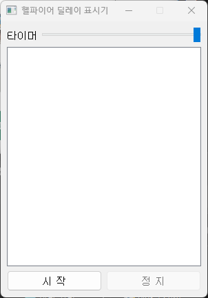
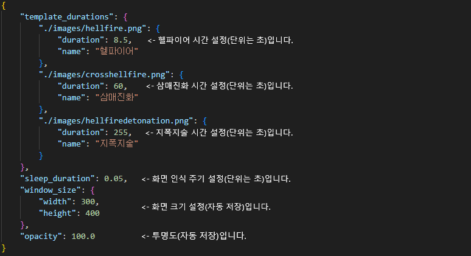

# 헬파이어 딜레이 표시기

이 프로젝트는 헬파이어 기술의 대기 시간을 관리하기 위한 PyQt5 기반 GUI 프로그램입니다. 이 프로그램은 특정 이미지(헬파이어 사용 상태)를 감지하여 타이머를 설정하고 대기 시간을 표시합니다.



## 요구사항

이 프로젝트를 실행하기 위해서는 다음과 같은 라이브러리가 필요합니다:

- Python 3.12
- PyQt5
- OpenCV (opencv-python)
- NumPy
- PyAutoGUI

### 설치 방법

다음 명령어를 통해 필요한 라이브러리를 설치할 수 있습니다:

```bash
pip install -r requirements.txt
```

## 실행 방법

프로젝트를 clone 받은 후, 다음 명령어를 통해 프로그램을 실행할 수 있습니다:

```bash
python delay-viewer.py
```

## 프로젝트 구조

- `delay-viewer.py`: 메인 프로그램 파일입니다.
- `images/`: 감지할 이미지 파일들을 저장하는 폴더입니다.

## 사용 방법

1. 프로그램을 실행한 후 '시작' 버튼을 클릭하면 이미지 인식을 시작합니다.
2. 특정 이미지(헬파이어 사용 상태)가 감지되면 타이머가 설정되어 대기 시간을 표시합니다.
3. '정지' 버튼을 클릭하면 이미지 인식이 중지되고 로그가 저장됩니다.

## 빌드 관련

빌드 및 배포와 관련된 `dist/`, `build/` 폴더는 `.gitignore`에 의해 제외되었습니다.

## 주의사항

- 프로그램을 실행하기 전에 `images/` 폴더에 필요한 이미지 파일(`hellfire.png`, `mp_zero.png` 등)이 있는지 확인하세요.
- 이 프로젝트는 특정 화면을 캡처하여 이미지 매칭을 수행하므로, 화면 해상도나 UI 요소의 위치에 따라 인식 정확도가 달라질 수 있습니다.
- 인식이 부정확하다면, 직접 캡쳐해서 해당 경로에 이미지를 넣어주시면됩니다.

## 설정 파일



- 각 마법들의 타이머를 사용자가 설정할 수 있습니다. 본인의 컴퓨팅 환경 및 네트워크 상황에 따라 미세한 조정을 통해 더욱 정확한 타이머를 설정할 수 있습니다.
- 화면 인식 주기를 사용자가 설정할 수 있습니다. 기본 0.05(50ms)로 설정됐으며, 0.01(10ms)까지 조정 가능하나 CPU 자원을 많이 소모할 수 있습니다.
- 화면 크기를 조절할 수 있습니다. 설정 파일에서 수정할 수 있지만, 프로그램 종료 시 자동 저장되므로 별도로 수정할 필요는 없습니다.
- 투명도를 조절할 수 있습니다. 설정 파일에서 수정할 수 있지만, 프로그램 종료 시 자동 저장되므로 별도로 수정할 필요는 없습니다.